# PowerAPI
| version | med (J) | stddev | cv | qcd |
| --- | --- | --- | --- | --- |
| PowerAPI v1 | 16012.872564216159 | 59.77 (0.37%) | 0.16% | 0.37% |
| PowerAPI v2 | 16063.950659621798 | 48.56 (0.30%) | 0.12% | 0.30% |
| PowerAPI Delta Energy (J) | 51.07809540563903 |

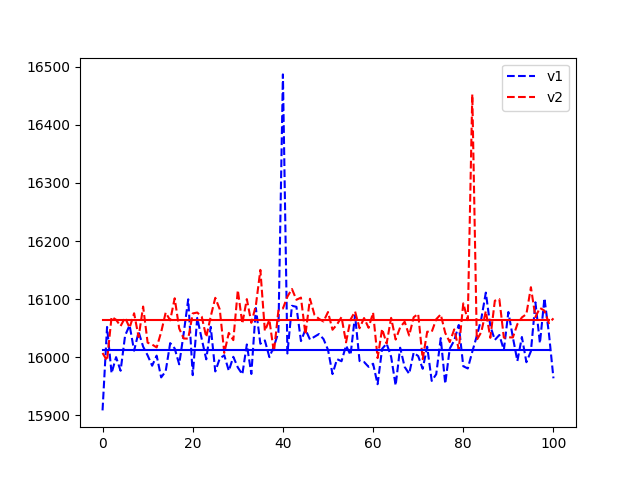
## testMapEmptyList

| measures | med(uJ/#) | stddev | cv | qcd |
| --- | --- | --- | --- | --- |
| Energy local v1 | 19684.5 | 17010.46 (86.42%) | 100.00% | 117.97% |
| Energy local v2 | 20752.0 | 10965.99 (52.84%) | 100.00% | 68.74% |
| Energy delta local | 1067.5 |
| Energy docker v1 | 20996.0 | 28184.95 (134.24%) | 4.45% | 106.60% |
| Energy docker v2 | 20996.0 | 26509.25 (126.26%) | 4.61% | 102.82% |
| Energy delta docker | 0.0 |
| Instructions local v1 | 428684.5 | 16278.13 (3.80%) | 1.07% | 3.77% |
| Instructions local v2 | 427796.0 | 14296.32 (3.34%) | 0.72% | 3.31% |
| Instructions delta local | -888.5 |
| Instructions docker v1 | 436162.5 | 24808.12 (5.69%) | 1.54% | 5.75% |
| Instructions docker v2 | 436154.5 | 24974.72 (5.73%) | 1.62% | 5.79% |
| Instructions delta docker | -8.0 |

### V1 vs V2 local

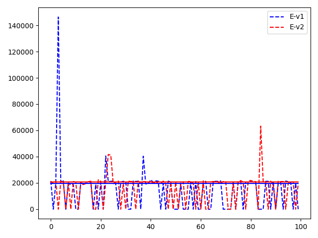

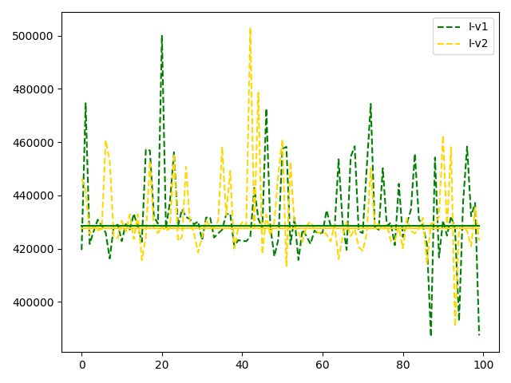

### Energy V1 vs V2 docker

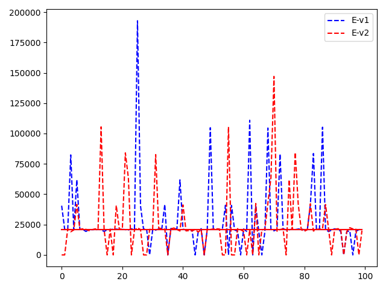

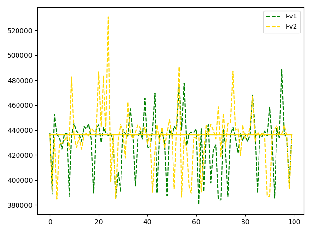

### V1 vs V2 docker medianes

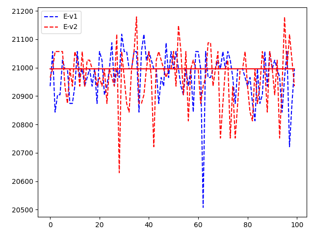

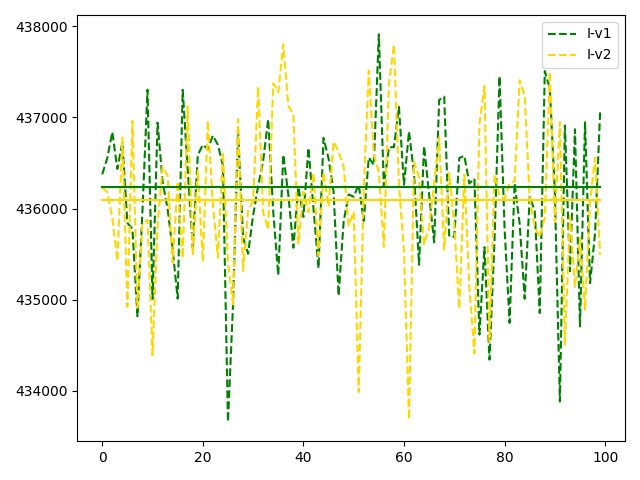

## testMapOneElement

| measures | med(uJ/#) | stddev | cv | qcd |
| --- | --- | --- | --- | --- |
| Energy local v1 | 21332.5 | 41295.86 (193.58%) | 60.45% | 94.49% |
| Energy local v2 | 21484.5 | 41247.50 (191.99%) | 61.06% | 85.95% |
| Energy delta local | 152.0 |
| Energy docker v1 | 20691.0 | 22848.48 (110.43%) | 100.00% | 121.76% |
| Energy docker v2 | 20751.0 | 24259.81 (116.91%) | 100.00% | 125.48% |
| Energy delta docker | 60.0 |
| Instructions local v1 | 376260.5 | 5783.38 (1.54%) | 0.89% | 1.53% |
| Instructions local v2 | 376774.5 | 10980.25 (2.91%) | 0.76% | 2.90% |
| Instructions delta local | 514.0 |
| Instructions docker v1 | 380762.5 | 8145.95 (2.14%) | 0.69% | 2.13% |
| Instructions docker v2 | 380720.5 | 7389.46 (1.94%) | 0.68% | 1.94% |
| Instructions delta docker | -42.0 |

### V1 vs V2 local

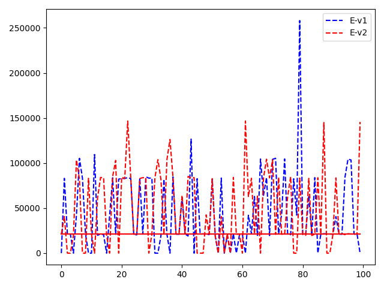

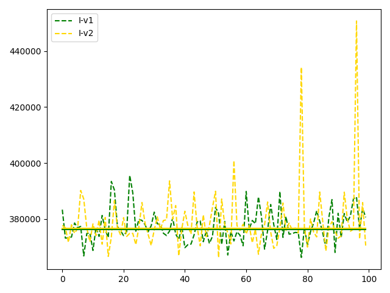

### Energy V1 vs V2 docker

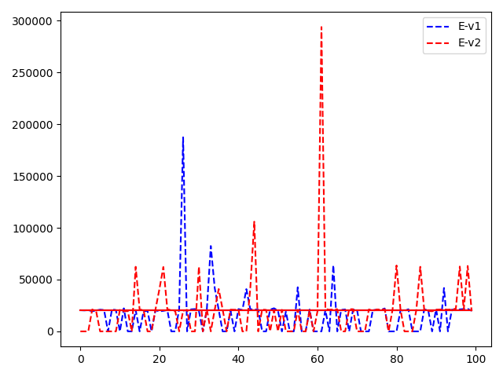

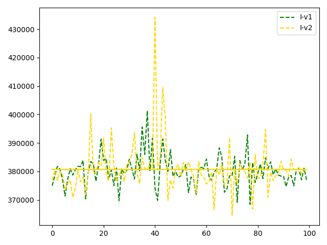

### V1 vs V2 docker medianes

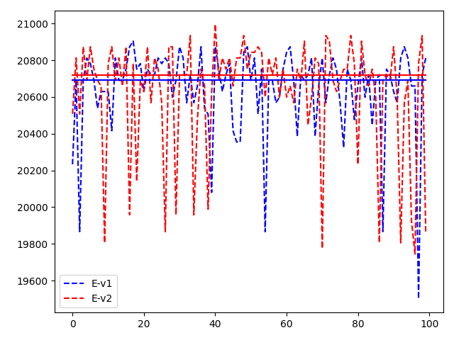

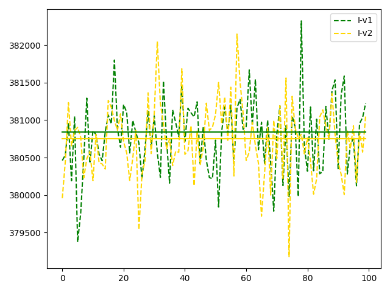

## testMapMultipleElement

| measures | med(uJ/#) | stddev | cv | qcd |
| --- | --- | --- | --- | --- |
| Energy local v1 | 41106.5 | 34700.55 (84.42%) | 33.85% | 75.54% |
| Energy local v2 | 41687.0 | 28708.64 (68.87%) | 48.74% | 59.14% |
| Energy delta local | 580.5 |
| Energy docker v1 | 21057.0 | 24093.80 (114.42%) | 2.61% | 87.24% |
| Energy docker v2 | 21057.0 | 25171.09 (119.54%) | 2.76% | 90.68% |
| Energy delta docker | 0.0 |
| Instructions local v1 | 624806.5 | 30069.37 (4.81%) | 1.07% | 4.76% |
| Instructions local v2 | 627044.0 | 22285.89 (3.55%) | 0.86% | 3.53% |
| Instructions delta local | 2237.5 |
| Instructions docker v1 | 633038.0 | 10968.14 (1.73%) | 0.67% | 1.73% |
| Instructions docker v2 | 633042.5 | 11314.91 (1.79%) | 0.67% | 1.78% |
| Instructions delta docker | 4.5 |

### V1 vs V2 local

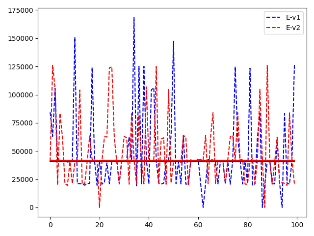

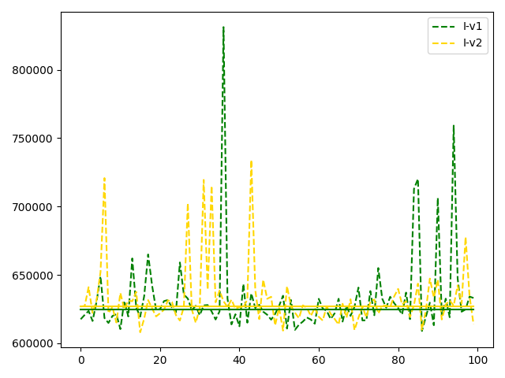

### Energy V1 vs V2 docker

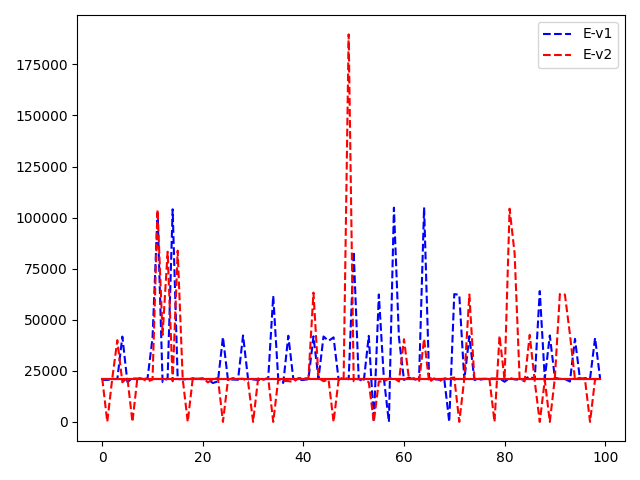

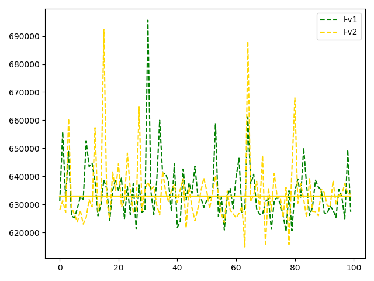

### V1 vs V2 docker medianes

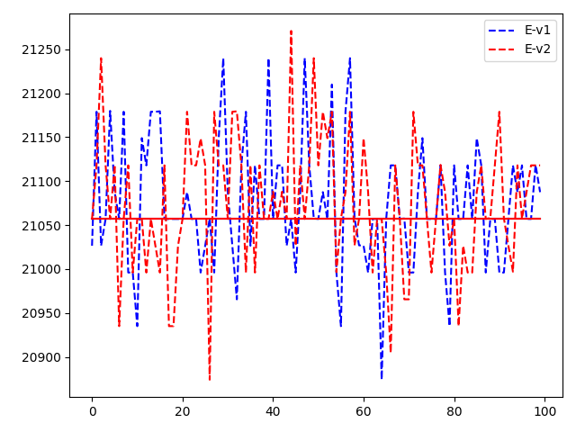

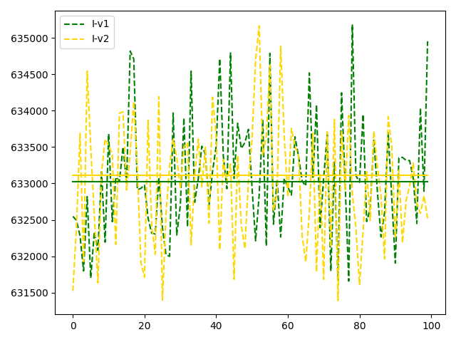

